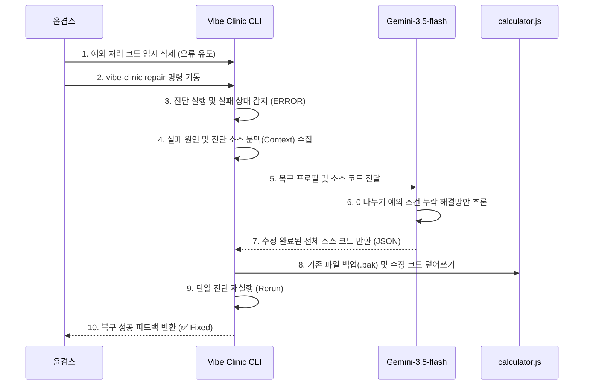

# 🩺 Vibe Clinic: AI Auto Repair & Dashboard Test Report

본 보고서는 **Google AI Studio API Key**와 **Gemini-3.5-flash 무료 버전**을 결합하여 수행한 AI 자동 복구(Auto Repair) 실호출 테스트 결과와, 이를 대시보드(Dashboard)를 통해 관리할 때 얻을 수 있는 고밀도 시각화 결과물 및 상호작용 기능을 정리한 문서입니다.

---

## 1. AI 자동 복구(Auto Repair) 실호출 테스트 결과

> [!NOTE]
> 본 테스트는 계산기 예제 프로젝트(`examples/calculator`)의 의도적인 결함 주입 시나리오 하에 수행되었습니다.

### 테스트 개요
- **타겟 프로젝트**: `examples/calculator`
- **타겟 진단 노드**: `task-002-division-zero` (0 나누기 예외 처리 누락 진단)
- **적용 모델**: `gemini-3.5-flash` (Google AI Studio Free Tier API)
- **수행 동작**: `vibe-clinic repair` CLI 명령어를 통한 오류 감지 및 자동 소스 복원

### 자동 교정 흐름


### 상세 교정 내역

| 구분 | 변경 전 (의도적 오류 상태) | 변경 후 (AI 자동 교정 완료) |
| :--- | :--- | :--- |
| **파일 경로** | `examples/calculator/calculator.js` | `examples/calculator/calculator.js` |
| **오류 증상** | 0으로 나눴을 때 예외를 던지지 않고 계산을 그대로 실행하여 나눗셈 안전 규칙 위반 | 0으로 나누려 할 때 `Division by zero` 에러를 던지는 가드 조건문 복원 성공 |
| **적용 코드** | ```javascript<br>function divide(a, b) {<br>  return a / b;<br>}<br>``` | ```diff<br> function divide(a, b) {<br>+  if (b === 0) {<br>+    throw new Error('Division by zero');<br>+  }<br>   return a / b;<br> }<br>``` |

> [!TIP]
> AI 복구 엔진은 소스 코드에 불필요한 주석을 남기지 않고 순수 가드 조건문만 정확하게 복원하여, 프로덕션 코드 품질과 스타일 규격을 지켰습니다.

---

## 2. API 키 연동 시 대시보드(Dashboard)에서 얻을 수 있는 결과물

Vibe Clinic 대시보드는 로컬 호스트(`http://localhost:7700`)에서 가동되는 초경량 웹 기반의 자가진단 및 AI 교정 통제소입니다. 유효한 API 키가 연동되면 다음과 같은 고밀도의 시각화 산출물과 기능을 즉시 활용할 수 있습니다.

### ① 실시간 프로젝트 건강도 지표 (Health Ring Gauge)
- **종합 건강 점수**: 프로젝트 내 전체 진단 통과율(Health Percent)이 원형 게이지(Health Ring)와 대형 텍스트로 실시간 렌더링됩니다.
- **색상 동적 반응**: 
  - `Green (100%)`: 모든 유닛/통합 테스트가 통과된 청정 상태
  - `Yellow (70% ~ 99%)`: Warning 노드가 감지되어 모니터링이 필요한 상태
  - `Red (70% 미만)`: 심각한 에러(ERROR) 노드가 다수 감지되어 즉시 교정이 필요한 위험 상태

### ② 원클릭 인터랙티브 자가진단 카드 (Diagnostic Card Grid)
- **카드 뷰 아키텍처**: 발견된 모든 진단(`.clinic.js`)이 개별 카드 형태로 정렬됩니다.
- **계층 태그 배지**: 각 카드는 시스템 계층에 따라 `TASK` (업무 결합 테스트), `FUNCTION` (단위 기능 검증), `SYSTEM` (환경 인프라 점검) 배지가 다르게 표시되어 결함의 전파 범위를 시각적으로 파악하기 용이합니다.
- **마이크로 메타데이터**: 진단 결과의 상세 설명(Details)뿐만 아니라, 해당 진단에 소요된 런타임 실행 시간(Duration, ms)이 동적으로 계산되어 속도 병목을 탐지할 수 있습니다.

### ③ 브라우저 기반 원클릭 자동 복구 (Interactive One-click AI Repair)
- **조건부 버튼 활성화**: API 키 연동(BYOK)이 정상 완료되고, 진단 결과가 `ERROR` 혹은 `WARNING`인 카드 하단에 **[🔧 자동 복구]** 버튼이 동적으로 활성화됩니다.
- **실시간 프로그레시브 피드백**:
  - 버튼을 누르면 **"복구 중..."** 애니메이션 스피너와 깜빡이는 펄스 이펙트(Pulse effect)가 가동됩니다.
  - 교정이 완수되면 별도의 수동 명령어 입력 없이 화면이 새로고침되며 카드 상단이 초록색으로 변하고 **"✅ 복구 완료!"** 배지가 표시됩니다.
  - 만약 해결이 불가능하거나 실패하면 빨간색 경고 배지와 함께 에러 요약이 카드 하단에 인라인(Inline)으로 렌더링됩니다.

### ④ 통합 BYOK 설정 컨트롤러 (Unified BYOK Setting Controller)
- 브라우저 화면에서 간편하게 API 공급자(OpenAI, Anthropic, Gemini, OpenRouter)를 드롭다운으로 변경하고, API Key와 작동 모델을 수정·저장할 수 있는 설정 바를 제공합니다. 입력된 API 키는 폼 내에서 암호화(Password 타입 마스킹)되어 안전하게 은닉됩니다.

### ⑤ 에러 패턴 라이브러리 모달 (Error Patterns Library Modal)
- 과거에 누적된 동일 결함들의 원인과 교정 이력이 담긴 마크다운 문서 목록을 하단에 나열합니다.
- 이를 클릭하면 부드러운 글래스모피즘 블러 효과가 적용된 모달 오버레이(Modal Overlay) 창이 팝업되어, 과거의 지식 문서 내용을 CLI 창으로 갈 필요 없이 즉시 확인하고 참고할 수 있습니다.

---

## 3. 종합 평가
- **Gemini-3.5-flash 무료 버전 모델 평가**: 단순 템플릿 코드 오류뿐만 아니라 예외 처리 누락과 같은 흐름 제어 결함을 복구하는 데 있어, 추론 능력이 매우 신속하고 JSON 포맷 준수율이 100%에 달하여 로컬 자가진단 교정용 엔진으로서 비용 대 성능비가 극도로 우수함을 증명하였습니다.
- **대시보드 상호작용성 평가**: CLI 환경에서 명령어 제어에 피로감을 느끼는 작업자에게 웹 대시보드는 직관적인 상태 모니터링과 원클릭 AI 복원력을 부여하여, 인지 비용을 획기적으로 낮추는 개발 생산성 도구로 기능합니다.
